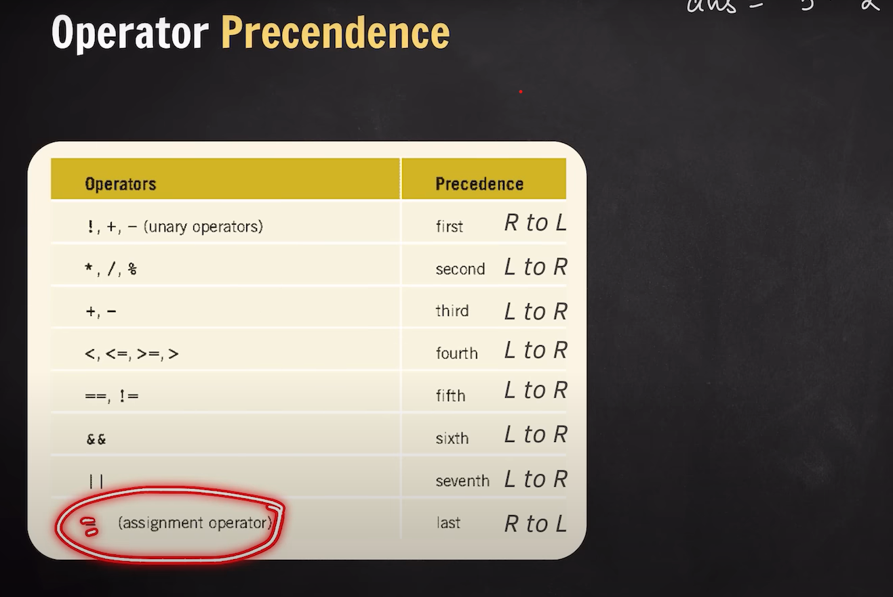

```
Operator precidence
```



```
negative number conversion

step1:  firstly convert  that in normal binary form.
step2:  prefix that binary number with 0;

step3: once Complement--
reversing the number;


step: Twos complement--
adding 1 in the Binary mumber;
```


```
--Pass by value :  int primitive data dype(int,char,float,boolean,Double) -- its only create the copy of that variable when we pass it in another variable or functions NOTE :- Do not change in original  copy of variable;

--Pass by Refrence : Array,Object : its change the original  data Type when we modifie it:
```